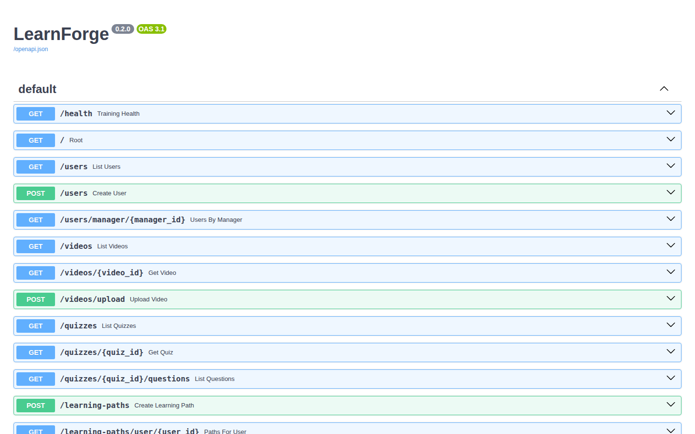
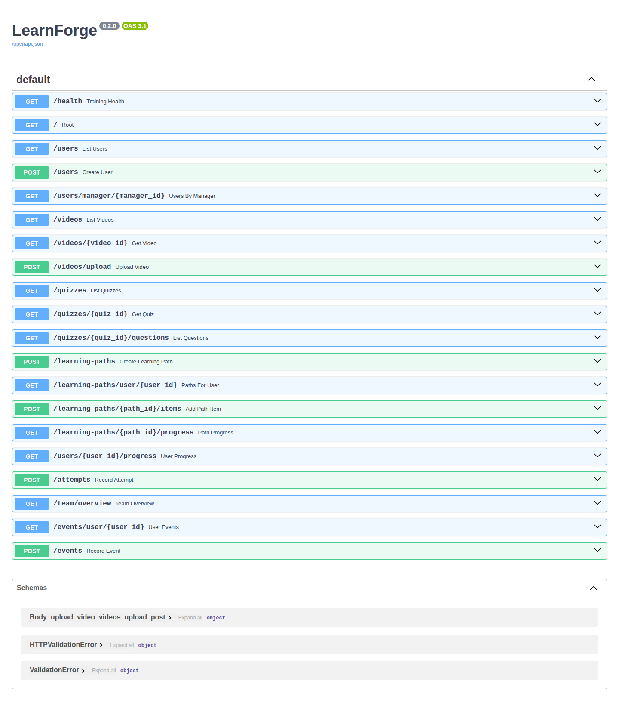

<div align="center">


# LearnForge

**The self-hosted IT training platform for teams — learning paths, AI-generated quizzes, progress tracking, and video ingestion with no cloud dependency.**

<a href="https://github.com/OneByJorah/LearnForge/stargazers"></a>
<a href="https://github.com/OneByJorah/LearnForge/commits"></a>


</div>


## What This Is

LearnForge packages everything an IT team needs to train and certify staff into one self-hosted Docker Compose stack: structured learning paths, AI-generated quizzes, trainee progress, and training video storage. The FastAPI backend, Qdrant vector store, MinIO object storage, and Ollama LLM all run on your own network, so training data never leaves the building.

It is aimed at IT teams onboarding new hires, MSPs certifying technicians on internal tooling, and educators who need automated assessment without a SaaS subscription.

## Quick Start

```bash
git clone https://github.com/OneByJorah/LearnForge.git
cd LearnForge
cp compose.env.example .env    # set MINIO_ROOT_PASSWORD and SECRET_KEY
docker compose up -d
```

Open the API at **http://localhost:8080** (interactive docs at `/docs`). MinIO console is on **http://localhost:9001**.

> [!WARNING]
> `SECRET_KEY` and `MINIO_ROOT_PASSWORD` have no safe defaults and must be set in `.env` before startup. Replace the example `changeme` values.

## Features

- **Learning paths** — ordered curricula with items and per-path prerequisites.
- **AI quizzes** — quiz and question models generated with a local Ollama LLM.
- **Progress tracking** — user, per-path, and team-level completion views plus event history.
- **Video ingestion** — upload training media into S3-compatible MinIO storage.
- **Semantic search** — Qdrant vector search over content (client wired into the API requirements).
- **Telegram bot** — learner notifications and interactive training prompts.
- **Role-aware users** — training users with manager relationships and event timelines.
- **One-command stack** — FastAPI + Postgres-ready SQLite + Qdrant + MinIO + Ollama via `make bootstrap`.

## Architecture

```
        ┌──────────┐   ┌──────────┐   ┌──────────┐   ┌──────────┐
        │  Ollama  │   │  Qdrant  │   │  MinIO   │   │ training │
        │  :11434  │   │  :6333   │   │ :9000/1  │   │   -api   │
        └────▲─────┘   └────▲─────┘   └────▲─────┘   │  :8080   │
             │              │              │         └────┬─────┘
             └──────────────┴──────────────┴──────────────┘
                              Docker network
```

`training-api` depends on Qdrant, MinIO, and Ollama being healthy before it starts; all four services expose healthchecks in `docker-compose.yml`.

## Configuration

Copy `compose.env.example` to `.env`. Values are read by the stack at startup.

| Variable | Default | Description |
|----------|---------|-------------|
| `MINIO_ROOT_USER` | `admin` | MinIO root username |
| `MINIO_ROOT_PASSWORD` | `changeme` | MinIO root password — **must be changed** |
| `OLLAMA_ORIGINS` | `*` | Allowed origins for the Ollama service |
| `DATABASE_URL` | `sqlite:///./app.db` | Training database (SQLite by default) |
| `SECRET_KEY` | `changeme` | App secret — **must be changed** |
| `TELEGRAM_BOT_TOKEN` | — | Telegram bot token for notifications |
| `TELEGRAM_ADMIN_CHAT_ID` | `change_me_admin_chat_id` | Admin chat for bot messages |
| `LOG_LEVEL` | `INFO` | Log verbosity |

## API Endpoints

Served by the `training-api` service (FastAPI, v0.2.0). Base is the API root; interactive docs at `/docs`.

| Endpoint | Method | Description |
|----------|--------|-------------|
| `/health` | GET | Service health |
| `/users` | GET/POST | List / create users |
| `/users/manager/{manager_id}` | GET | Users reporting to a manager |
| `/users/{user_id}/progress` | GET | Per-user progress |
| `/videos` | GET | List training videos |
| `/videos/{video_id}` | GET | Video detail |
| `/videos/upload` | POST | Upload training media |
| `/quizzes` | GET | List quizzes |
| `/quizzes/{quiz_id}/questions` | GET | Quiz questions |
| `/learning-paths` | POST | Create a learning path |
| `/learning-paths/user/{user_id}` | GET | Paths assigned to a user |
| `/learning-paths/{path_id}/items` | POST | Add an item to a path |
| `/learning-paths/{path_id}/progress` | GET | Path-level progress |
| `/attempts` | POST | Record a quiz attempt |
| `/team/overview` | GET | Team completion overview |
| `/events` | GET/POST | Training event timeline |

## Use Cases

1. **IT teams** — onboard new hires with structured paths and automated quizzes.
2. **MSPs** — certify technicians on internal tools and track completion.
3. **Educators** — deliver IT curriculum with AI-assisted assessment.

## Tech Stack

FastAPI, uvicorn, SQLAlchemy, SQLite/PostgreSQL, Qdrant, MinIO, Ollama, Telegram Bot API, Docker Compose, Make.

## Screenshots

| Dashboard | Full view |
|---|---|
|  |  |

More captures live in [`docs/screenshots/`](docs/screenshots/).

## Contributing

Contributions are welcome — see [CONTRIBUTING.md](CONTRIBUTING.md). [Open an issue](https://github.com/OneByJorah/LearnForge/issues) to report a bug or request a feature.

## License

MIT — see [LICENSE](LICENSE).

## Connect

- [jorahone.com](https://jorahone.com)
- [GitHub Org](https://github.com/OneByJorah)
- [info@jorahone.com](mailto:info@jorahone.com)
